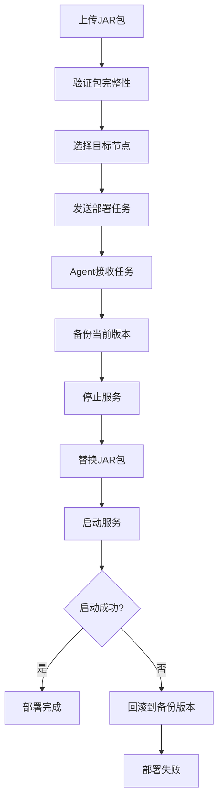

# 分布式服务监控与部署系统设计文档

## 1. 系统概述

### 1.1 项目背景
本系统旨在实现分布式SpringBoot服务的统一监控和自动化部署管理，通过Redis集群作为通信桥梁，实现master节点对多个agent节点的集中管理和监控。

### 1.2 核心功能
- **服务监控**：实时监控集群中所有服务的健康状态、运行状态、资源使用情况
- **服务部署**：支持文件上传、包分发、服务启停、启动检测、失败回滚
- **集中管理**：通过master节点统一管理所有agent节点

### 1.3 技术栈
- **开发环境**：Java 8 + SpringBoot 2.7.18 + Maven 3.6.3
- **中间件**：Redis 4.x集群
- **部署方式**：JAR包部署

## 2. 系统架构

### 2.1 整体架构图
```
┌─────────────────┐    ┌─────────────────┐    ┌─────────────────┐
│   Master节点    │    │   Redis集群     │    │   Agent节点A    │
│                 │    │                 │    │                 │
│ ┌─────────────┐ │    │ ┌─────────────┐ │    │ ┌─────────────┐ │
│ │监控面板     │ │◄──►│ │消息队列     │ │◄──►│ │健康上报     │ │
│ └─────────────┘ │    │ └─────────────┘ │    │ └─────────────┘ │
│ ┌─────────────┐ │    │ ┌─────────────┐ │    │ ┌─────────────┐ │
│ │部署管理     │ │◄──►│ │任务分发     │ │◄──►│ │任务执行     │ │
│ └─────────────┘ │    │ └─────────────┘ │    │ └─────────────┘ │
└─────────────────┘    └─────────────────┘    └─────────────────┘
                                │
                                ▼
                       ┌─────────────────┐
                       │   Agent节点B    │
                       │                 │
                       │ ┌─────────────┐ │
                       │ │健康上报     │ │
                       │ └─────────────┘ │
                       │ ┌─────────────┐ │
                       │ │任务执行     │ │
                       │ └─────────────┘ │
                       └─────────────────┘
```

### 2.2 组件说明

#### 2.2.1 Master节点
- **监控面板**：展示所有agent节点的运行状态
- **部署管理**：文件上传、包分发、服务启停控制
- **任务调度**：向agent节点发送部署任务

#### 2.2.2 Agent节点
- **健康上报**：定期向master节点上报服务状态
- **任务执行**：接收并执行master节点的部署指令
- **服务管理**：启动、停止、重启本地服务

#### 2.2.3 Redis集群
- **消息队列**：master-agent通信桥梁
- **状态存储**：存储各节点状态信息
- **任务分发**：任务队列管理

## 3. 详细设计

### 3.1 监控功能设计

#### 3.1.1 监控指标
```yaml
监控指标:
  服务状态:
    - 运行状态 (RUNNING/STOPPED/ERROR)
    - 健康检查 (HEALTHY/UNHEALTHY)
    - 启动时间
    - 最后心跳时间
  
  资源使用:
    - CPU使用率
    - 内存使用率
    - 磁盘使用率
    - JVM堆内存使用情况
  
  业务指标:
    - 请求总数
    - 错误率
    - 响应时间
    - 活跃连接数
```

#### 3.1.2 数据上报机制
```java
// Agent节点定期上报状态
@Scheduled(fixedRate = 30000) // 30秒上报一次
public void reportStatus() {
    StatusReport report = new StatusReport();
    report.setNodeId(nodeId);
    report.setTimestamp(System.currentTimeMillis());
    report.setCpuUsage(getCpuUsage());
    report.setMemoryUsage(getMemoryUsage());
    report.setServiceStatus(getServiceStatus());
    
    // 通过Redis发送状态报告
    redisTemplate.convertAndSend("status:report", report);
}
```

### 3.2 部署功能设计

#### 3.2.1 文件分发方案
**方案一：共享存储分发（推荐）**
- 优点：支持1GB+文件，传输效率最高，无内存限制
- 缺点：需要共享存储（NFS/SMB/对象存储）
- 适用：生产环境首选方案
- 实现：Master将JAR包放到共享存储，Agent从共享存储拉取

**方案二：HTTP分发**
- 优点：支持1GB+文件，跨网络部署，断点续传
- 缺点：需要额外的文件服务器
- 适用：跨机房、跨网络部署
- 实现：Master启动HTTP服务，Agent通过HTTP下载

**❌ 不推荐方案：Redis分片传输**
- 问题：1GB文件需要100+分片，Redis内存占用大，性能差
- 结论：仅适用于小文件（<50MB）

**专业推荐：混合分发模式**
- 小文件（<50MB）：Redis直接传输
- 大文件（≥50MB）：共享存储分发
- 超大文件（≥500MB）：HTTP分发 + 断点续传

**重要说明：Redis只作为消息桥梁，不存储大文件**
- Redis存储：任务信息、节点状态、消息通知
- 大文件存储：共享存储或HTTP服务器
- 文件传输：通过共享存储或HTTP，不通过Redis

#### 3.2.1.1 具体实现方案

**方案A：共享存储分发（生产推荐）**
```yaml
# 配置示例
deploy:
  file-distribution:
    method: shared-storage
    shared-storage:
      type: nfs  # 或 smb, minio
      path: /mnt/shared/jars
      mount-point: /opt/shared
    # 实现逻辑：
    # 1. Master将JAR包复制到共享存储
    # 2. 通过Redis通知Agent文件路径
    # 3. Agent从共享存储拉取文件
```

**方案B：HTTP分发（跨网络推荐）**
```yaml
# 配置示例
deploy:
  file-distribution:
    method: http
    http-server:
      port: 8080
      base-path: /download
      max-file-size: 2GB
    # 实现逻辑：
    # 1. Master启动HTTP文件服务
    # 2. 通过Redis发送下载URL给Agent
    # 3. Agent通过HTTP下载，支持断点续传
```

**方案C：对象存储分发（云环境推荐）**
```yaml
# 配置示例
deploy:
  file-distribution:
    method: object-storage
    object-storage:
      type: minio  # 或 oss, s3
      endpoint: http://minio:9000
      bucket: jar-files
      access-key: your-access-key
      secret-key: your-secret-key
    # 实现逻辑：
    # 1. Master上传JAR包到对象存储
    # 2. 通过Redis发送下载链接给Agent
    # 3. Agent从对象存储下载
```

#### 3.2.2 部署流程


### 3.3 通信机制设计

#### 3.3.1 Redis消息队列结构
```yaml
Redis队列设计:
  状态上报:
    - 队列名: "status:report"
    - 消息格式: JSON格式的状态报告
  
  任务分发:
    - 队列名: "task:deploy:{nodeId}"
    - 消息格式: 部署任务JSON
  
  任务结果:
    - 队列名: "task:result:{nodeId}"
    - 消息格式: 任务执行结果JSON
```

#### 3.3.2 Redis存储键值设计
```yaml
Redis键值结构（只存储消息和元数据，不存储大文件）:
  # 节点状态存储（长时间缓存，2个月过期）
  node:status:{nodeId} -> JSON格式的节点状态信息 (TTL: 5184000秒 = 60天)
  node:list -> Set类型，存储所有节点ID (TTL: 5184000秒)
  
  # 部署任务管理（任务完成后保留7天）
  task:deploy:{taskId} -> JSON格式的部署任务信息 (TTL: 604800秒 = 7天)
  task:result:{taskId} -> JSON格式的任务执行结果 (TTL: 604800秒)
  task:queue:{nodeId} -> List类型，节点任务队列 (TTL: 3600秒 = 1小时)
  
  # 服务信息存储（长时间缓存）
  service:info:{nodeId}:{serviceName} -> JSON格式的服务信息 (TTL: 5184000秒)
  service:list:{nodeId} -> Set类型，节点上的服务列表 (TTL: 5184000秒)
  service:deploy:{nodeId}:{serviceName} -> 服务部署信息 (TTL: 5184000秒)
  
  # 文件分发管理（只存储元数据，不存储文件内容）
  file:info:{taskId} -> JSON格式的文件信息 (TTL: 604800秒)
  file:progress:{taskId} -> 文件传输进度 (TTL: 3600秒)
  file:status:{taskId} -> 文件传输状态 (TTL: 3600秒)
  
  # 系统配置（永久存储）
  config:master -> Master节点配置信息 (TTL: -1 = 永不过期)
  config:agent:{nodeId} -> Agent节点配置信息 (TTL: -1)
  
  # 消息队列（短期存储）
  queue:status:report -> 状态上报消息队列 (TTL: 3600秒)
  queue:task:deploy -> 部署任务消息队列 (TTL: 3600秒)
  queue:task:result -> 任务结果消息队列 (TTL: 3600秒)
  
  # 文件分发通知（短期存储）
  notification:file:ready:{nodeId} -> 文件准备就绪通知 (TTL: 3600秒)
  notification:download:complete:{nodeId} -> 下载完成通知 (TTL: 3600秒)
  
  # 部署历史记录（长期存储）
  deploy:history:{nodeId}:{serviceName} -> 部署历史记录 (TTL: 15552000秒 = 180天)
  deploy:current:{nodeId}:{serviceName} -> 当前部署版本 (TTL: 5184000秒)
```

#### 3.3.3 消息格式定义
```java
// 状态报告消息
public class StatusReport {
    private String nodeId;
    private long timestamp;
    private String serviceStatus;
    private double cpuUsage;
    private double memoryUsage;
    private String healthStatus;
    private long lastDeployTime; // 最近部署时间
    private String lastDeployVersion; // 最近部署版本（基于时间戳）
    // getter/setter...
}

// 部署任务消息（Redis只存储任务信息，不存储文件内容）
public class DeployTask {
    private String taskId;
    private String nodeId;
    private String serviceName;
    private String action; // START/STOP/RESTART/DEPLOY
    private String distributionMethod; // shared-storage, http
    private String filePath; // 共享存储路径或HTTP下载URL
    private long fileSize;
    private String fileChecksum;
    // getter/setter...
}

// 文件信息（只存储元数据）
public class FileInfo {
    private String taskId;
    private String filePath;
    private String downloadUrl;
    private long fileSize;
    private String checksum;
    private String distributionMethod;
    // getter/setter...
}

// 文件传输进度
public class FileProgress {
    private String taskId;
    private String nodeId;
    private int progress; // 0-100
    private String status; // PENDING/TRANSFERRING/COMPLETED/FAILED
    private String message;
    // getter/setter...
}

// 批量部署请求
public class BatchDeployRequest {
    private boolean forceDeploy; // 是否强制部署
    private String deployMode; // 部署模式：parallel(并行) 或 sequential(串行)
    // getter/setter...
}

// 选定服务部署请求
public class SelectedDeployRequest {
    private List<String> serviceNames; // 要部署的服务名称列表
    private boolean forceDeploy; // 是否强制部署
    private String deployMode; // 部署模式
    // getter/setter...
}

// 批量部署结果
public class BatchDeployResult {
    private int totalServices; // 总服务数
    private List<String> taskIds; // 任务ID列表
    private String status; // 部署状态
    private long startTime; // 开始时间
    // getter/setter...
}

// 服务信息
public class ServiceInfo {
    private String name; // 服务名称
    private String jarName; // JAR文件名
    private String jarPath; // JAR文件路径
    private List<String> targetNodes; // 目标节点列表
    private String description; // 服务描述
    // getter/setter...
}

// 回滚请求
public class RollbackRequest {
    private String targetVersion; // 目标版本（可选，默认回滚到上一个版本）
    private boolean forceRollback; // 是否强制回滚
    private String rollbackReason; // 回滚原因
    // getter/setter...
}

// 选定服务回滚请求
public class SelectedRollbackRequest {
    private List<String> serviceNames; // 要回滚的服务名称列表
    private String targetVersion; // 目标版本
    private boolean forceRollback; // 是否强制回滚
    private String rollbackReason; // 回滚原因
    // getter/setter...
}

// 回滚结果
public class RollbackResult {
    private int totalServices; // 总服务数
    private int successCount; // 成功回滚数
    private int failedCount; // 失败回滚数
    private List<RollbackDetail> rollbackDetails; // 回滚详情
    private String status; // 回滚状态
    private long startTime; // 开始时间
    // getter/setter...
}

// 回滚详情
public class RollbackDetail {
    private String serviceName; // 服务名称
    private String taskId; // 任务ID
    private boolean success; // 是否成功
    private String errorMessage; // 错误信息
    private String fromVersion; // 从版本
    private String toVersion; // 到版本
    private long rollbackTime; // 回滚时间
    // getter/setter...
}

// 回滚历史
public class RollbackHistory {
    private String serviceName; // 服务名称
    private String fromVersion; // 从版本
    private String toVersion; // 到版本
    private String reason; // 回滚原因
    private long rollbackTime; // 回滚时间
    private String operator; // 操作人
    private String status; // 回滚状态
    // getter/setter...
}

// 服务版本信息
public class ServiceVersion {
    private String version; // 版本号
    private String jarPath; // JAR文件路径
    private long fileSize; // 文件大小
    private String checksum; // 文件校验和
    private long createTime; // 创建时间
    private boolean isCurrent; // 是否为当前版本
    private String description; // 版本描述
    // getter/setter...
}

// 增强的任务状态（包含详细失败信息）
public class TaskStatus {
    private String taskId; // 任务ID
    private String serviceName; // 服务名称
    private String status; // 任务状态：PENDING/RUNNING/COMPLETED/FAILED
    private String errorMessage; // 错误信息
    private String errorCode; // 错误代码
    private String errorDetails; // 错误详情
    private long startTime; // 开始时间
    private long endTime; // 结束时间
    private int progress; // 进度百分比
    private List<String> targetNodes; // 目标节点
    private Map<String, String> nodeResults; // 各节点执行结果
    // getter/setter...
}

// 节点状态信息
public class NodeStatus {
    private String nodeId; // 节点ID
    private String nodeName; // 节点名称
    private String serviceStatus; // 服务状态
    private double cpuUsage; // CPU使用率
    private double memoryUsage; // 内存使用率
    private String healthStatus; // 健康状态
    private long lastHeartbeat; // 最后心跳时间
    private long lastDeployTime; // 最近部署时间
    private String lastDeployVersion; // 最近部署版本
    private long uptime; // 服务运行时间（毫秒）
    private String jarPath; // 当前JAR文件路径
    private long jarFileSize; // JAR文件大小
    private long jarFileTime; // JAR文件修改时间
    // getter/setter...
}

// 节点详情信息
public class NodeDetail {
    private String nodeId; // 节点ID
    private String nodeName; // 节点名称
    private String serviceStatus; // 服务状态
    private double cpuUsage; // CPU使用率
    private double memoryUsage; // 内存使用率
    private String healthStatus; // 健康状态
    private long lastHeartbeat; // 最后心跳时间
    private long lastDeployTime; // 最近部署时间
    private String lastDeployVersion; // 最近部署版本
    private long uptime; // 服务运行时间
    private String jarPath; // 当前JAR文件路径
    private long jarFileSize; // JAR文件大小
    private long jarFileTime; // JAR文件修改时间
    private List<ServiceInfo> services; // 节点上的服务列表
    private Map<String, Object> systemInfo; // 系统信息
    // getter/setter...
}

// 健康状态信息
public class HealthStatus {
    private String nodeId; // 节点ID
    private String serviceName; // 服务名称
    private String status; // 健康状态：HEALTHY/UNHEALTHY/UNKNOWN
    private long checkTime; // 检查时间
    private String message; // 状态消息
    private long lastDeployTime; // 最近部署时间
    private String lastDeployVersion; // 最近部署版本
    private long uptime; // 服务运行时间
    // getter/setter...
}
```

## 4. 技术实现

### 4.1 Master节点实现

#### 4.1.1 监控面板Controller
```java
@RestController
@RequestMapping("/api/monitor")
@Api(tags = "服务监控")
public class MonitorController {
    
    @Autowired
    private JedisCluster jedisCluster;
    
    @ApiOperation("获取所有节点状态")
    @GetMapping("/nodes")
    public ApiResponse<List<NodeStatus>> getAllNodes() {
        List<NodeStatus> nodes = getNodeStatusFromRedis();
        // 为每个节点添加部署时间信息
        for (NodeStatus node : nodes) {
            enrichNodeWithDeployInfo(node);
        }
        return ApiResponse.success(nodes);
    }
    
    @ApiOperation("获取单个节点详情")
    @GetMapping("/nodes/{nodeId}")
    public ApiResponse<NodeDetail> getNodeDetail(@PathVariable String nodeId) {
        NodeDetail detail = getNodeDetailFromRedis(nodeId);
        // 添加详细的部署信息
        enrichNodeDetailWithDeployInfo(detail);
        return ApiResponse.success(detail);
    }
    
    @ApiOperation("获取节点健康状态")
    @GetMapping("/health/{nodeId}")
    public ApiResponse<HealthStatus> getNodeHealth(@PathVariable String nodeId) {
        HealthStatus health = getNodeHealthFromRedis(nodeId);
        // 添加部署时间信息
        enrichHealthWithDeployInfo(health);
        return ApiResponse.success(health);
    }
    
    @ApiOperation("获取节点部署历史")
    @GetMapping("/deploy-history/{nodeId}")
    public ApiResponse<List<DeployHistory>> getNodeDeployHistory(@PathVariable String nodeId) {
        List<DeployHistory> history = getDeployHistoryFromRedis(nodeId);
        return ApiResponse.success(history);
    }
    
    @ApiOperation("获取服务部署状态")
    @GetMapping("/deploy-status/{nodeId}/{serviceName}")
    public ApiResponse<DeployStatus> getServiceDeployStatus(@PathVariable String nodeId, @PathVariable String serviceName) {
        DeployStatus status = getServiceDeployStatusFromRedis(nodeId, serviceName);
        return ApiResponse.success(status);
    }
    
    // 为节点状态添加部署信息
    private void enrichNodeWithDeployInfo(NodeStatus node) {
        try {
            // 获取JAR文件信息
            String jarPath = getJarPath(node.getNodeId());
            if (jarPath != null) {
                File jarFile = new File(jarPath);
                if (jarFile.exists()) {
                    node.setJarPath(jarPath);
                    node.setJarFileSize(jarFile.length());
                    node.setJarFileTime(jarFile.lastModified());
                    
                    // 设置最近部署时间（基于JAR文件修改时间）
                    node.setLastDeployTime(jarFile.lastModified());
                    node.setLastDeployVersion("v" + jarFile.lastModified());
                }
            }
            
            // 计算服务运行时间
            if (node.getLastDeployTime() > 0) {
                long uptime = System.currentTimeMillis() - node.getLastDeployTime();
                node.setUptime(uptime);
            }
            
        } catch (Exception e) {
            log.warn("获取节点 {} 部署信息失败: {}", node.getNodeId(), e.getMessage());
        }
    }
    
    // 为节点详情添加部署信息
    private void enrichNodeDetailWithDeployInfo(NodeDetail detail) {
        enrichNodeWithDeployInfo(detail);
        
        // 添加系统信息
        Map<String, Object> systemInfo = new HashMap<>();
        systemInfo.put("javaVersion", System.getProperty("java.version"));
        systemInfo.put("osName", System.getProperty("os.name"));
        systemInfo.put("osVersion", System.getProperty("os.version"));
        systemInfo.put("totalMemory", Runtime.getRuntime().totalMemory());
        systemInfo.put("freeMemory", Runtime.getRuntime().freeMemory());
        detail.setSystemInfo(systemInfo);
    }
    
    // 为健康状态添加部署信息
    private void enrichHealthWithDeployInfo(HealthStatus health) {
        try {
            String jarPath = getJarPath(health.getNodeId());
            if (jarPath != null) {
                File jarFile = new File(jarPath);
                if (jarFile.exists()) {
                    health.setLastDeployTime(jarFile.lastModified());
                    health.setLastDeployVersion("v" + jarFile.lastModified());
                    
                    // 计算运行时间
                    long uptime = System.currentTimeMillis() - jarFile.lastModified();
                    health.setUptime(uptime);
                }
            }
        } catch (Exception e) {
            log.warn("获取健康状态部署信息失败: {}", e.getMessage());
        }
    }
}
```

#### 4.1.2 部署管理Controller
```java
@RestController
@RequestMapping("/api/deploy")
@Api(tags = "服务部署")
public class DeployController {
    
    @Autowired
    private GitService gitService;
    
    @Autowired
    private BuildService buildService;
    
    @Autowired
    private FileDistributionService fileDistributionService;
    
    @ApiOperation("从Git构建JAR包")
    @PostMapping("/build")
    public ApiResponse<String> buildFromGit(@RequestBody GitBuildRequest request) {
        try {
            String projectPath = gitService.cloneOrPull(request.getGitUrl(), request.getBranch());
            String jarPath = buildService.buildProject(projectPath, request.getServiceName());
            return ApiResponse.success(jarPath);
        } catch (Exception e) {
            return ApiResponse.error("构建失败: " + e.getMessage());
        }
    }
    
    @ApiOperation("上传JAR包")
    @PostMapping("/upload")
    public ApiResponse<String> uploadJar(@RequestParam("file") MultipartFile file) {
        String jarPath = saveUploadedFile(file);
        return ApiResponse.success(jarPath);
    }
    
    @ApiOperation("部署服务")
    @PostMapping("/deploy")
    public ApiResponse<String> deployService(@RequestBody DeployRequest request) {
        try {
            File jarFile = new File(request.getJarPath());
            String method = fileDistributionService.selectDistributionMethod(jarFile.length());
            String result = fileDistributionService.distributeFile(request.getJarPath(), request.getTargetNodes(), method);
            String taskId = createDeployTask(request, result);
            return ApiResponse.success(taskId);
        } catch (Exception e) {
            return ApiResponse.error("部署失败: " + e.getMessage());
        }
    }
    
    @ApiOperation("获取任务状态")
    @GetMapping("/status/{taskId}")
    public ApiResponse<TaskStatus> getTaskStatus(@PathVariable String taskId) {
        TaskStatus status = getTaskStatusFromRedis(taskId);
        return ApiResponse.success(status);
    }
    
    @ApiOperation("获取服务列表")
    @GetMapping("/services")
    public ApiResponse<List<ServiceInfo>> getAvailableServices() {
        List<ServiceInfo> services = getServicesFromConfig();
        return ApiResponse.success(services);
    }
    
    @ApiOperation("一键部署所有服务")
    @PostMapping("/deploy-all")
    public ApiResponse<BatchDeployResult> deployAllServices(@RequestBody BatchDeployRequest request) {
        try {
            List<ServiceInfo> services = getServicesFromConfig();
            List<String> taskIds = new ArrayList<>();
            
            for (ServiceInfo service : services) {
                // 为每个服务创建部署任务
                DeployRequest deployRequest = new DeployRequest();
                deployRequest.setServiceName(service.getName());
                deployRequest.setJarPath(service.getJarPath());
                deployRequest.setTargetNodes(service.getTargetNodes());
                
                String taskId = createDeployTask(deployRequest, null);
                taskIds.add(taskId);
            }
            
            BatchDeployResult result = new BatchDeployResult();
            result.setTotalServices(services.size());
            result.setTaskIds(taskIds);
            result.setStatus("批量部署任务已创建");
            
            return ApiResponse.success(result);
        } catch (Exception e) {
            return ApiResponse.error("批量部署失败: " + e.getMessage());
        }
    }
    
    @ApiOperation("部署特定服务")
    @PostMapping("/deploy-selected")
    public ApiResponse<BatchDeployResult> deploySelectedServices(@RequestBody SelectedDeployRequest request) {
        try {
            List<String> serviceNames = request.getServiceNames();
            List<String> taskIds = new ArrayList<>();
            
            for (String serviceName : serviceNames) {
                ServiceInfo service = getServiceByName(serviceName);
                if (service == null) {
                    continue; // 跳过不存在的服务
                }
                
                DeployRequest deployRequest = new DeployRequest();
                deployRequest.setServiceName(service.getName());
                deployRequest.setJarPath(service.getJarPath());
                deployRequest.setTargetNodes(service.getTargetNodes());
                
                String taskId = createDeployTask(deployRequest, null);
                taskIds.add(taskId);
            }
            
            BatchDeployResult result = new BatchDeployResult();
            result.setTotalServices(serviceNames.size());
            result.setTaskIds(taskIds);
            result.setStatus("选定服务部署任务已创建");
            
            return ApiResponse.success(result);
        } catch (Exception e) {
            return ApiResponse.error("选定服务部署失败: " + e.getMessage());
        }
    }
    
    @ApiOperation("获取批量部署状态")
    @GetMapping("/batch-status")
    public ApiResponse<List<TaskStatus>> getBatchDeployStatus(@RequestParam List<String> taskIds) {
        List<TaskStatus> statusList = new ArrayList<>();
        for (String taskId : taskIds) {
            TaskStatus status = getTaskStatusFromRedis(taskId);
            statusList.add(status);
        }
        return ApiResponse.success(statusList);
    }
    
    @ApiOperation("一键回滚所有服务")
    @PostMapping("/rollback-all")
    public ApiResponse<RollbackResult> rollbackAllServices(@RequestBody RollbackRequest request) {
        try {
            List<ServiceInfo> services = getServicesFromConfig();
            List<String> rollbackTaskIds = new ArrayList<>();
            List<RollbackDetail> rollbackDetails = new ArrayList<>();
            
            for (ServiceInfo service : services) {
                try {
                    RollbackDetail detail = rollbackService(service, request);
                    rollbackDetails.add(detail);
                    if (detail.isSuccess()) {
                        rollbackTaskIds.add(detail.getTaskId());
                    }
                } catch (Exception e) {
                    RollbackDetail detail = new RollbackDetail();
                    detail.setServiceName(service.getName());
                    detail.setSuccess(false);
                    detail.setErrorMessage(e.getMessage());
                    rollbackDetails.add(detail);
                }
            }
            
            RollbackResult result = new RollbackResult();
            result.setTotalServices(services.size());
            result.setSuccessCount(rollbackDetails.stream().mapToInt(d -> d.isSuccess() ? 1 : 0).sum());
            result.setFailedCount(rollbackDetails.stream().mapToInt(d -> d.isSuccess() ? 0 : 1).sum());
            result.setRollbackDetails(rollbackDetails);
            result.setStatus("批量回滚任务已创建");
            
            return ApiResponse.success(result);
        } catch (Exception e) {
            return ApiResponse.error("批量回滚失败: " + e.getMessage());
        }
    }
    
    @ApiOperation("回滚特定服务")
    @PostMapping("/rollback-selected")
    public ApiResponse<RollbackResult> rollbackSelectedServices(@RequestBody SelectedRollbackRequest request) {
        try {
            List<String> serviceNames = request.getServiceNames();
            List<RollbackDetail> rollbackDetails = new ArrayList<>();
            
            for (String serviceName : serviceNames) {
                try {
                    ServiceInfo service = getServiceByName(serviceName);
                    if (service == null) {
                        RollbackDetail detail = new RollbackDetail();
                        detail.setServiceName(serviceName);
                        detail.setSuccess(false);
                        detail.setErrorMessage("服务不存在");
                        rollbackDetails.add(detail);
                        continue;
                    }
                    
                    RollbackDetail detail = rollbackService(service, request);
                    rollbackDetails.add(detail);
                } catch (Exception e) {
                    RollbackDetail detail = new RollbackDetail();
                    detail.setServiceName(serviceName);
                    detail.setSuccess(false);
                    detail.setErrorMessage(e.getMessage());
                    rollbackDetails.add(detail);
                }
            }
            
            RollbackResult result = new RollbackResult();
            result.setTotalServices(serviceNames.size());
            result.setSuccessCount(rollbackDetails.stream().mapToInt(d -> d.isSuccess() ? 1 : 0).sum());
            result.setFailedCount(rollbackDetails.stream().mapToInt(d -> d.isSuccess() ? 0 : 1).sum());
            result.setRollbackDetails(rollbackDetails);
            result.setStatus("选定服务回滚任务已创建");
            
            return ApiResponse.success(result);
        } catch (Exception e) {
            return ApiResponse.error("选定服务回滚失败: " + e.getMessage());
        }
    }
    
    @ApiOperation("获取回滚历史")
    @GetMapping("/rollback-history")
    public ApiResponse<List<RollbackHistory>> getRollbackHistory(@RequestParam(required = false) String serviceName) {
        List<RollbackHistory> history = getRollbackHistoryFromRedis(serviceName);
        return ApiResponse.success(history);
    }
    
    @ApiOperation("获取服务版本信息")
    @GetMapping("/versions/{serviceName}")
    public ApiResponse<List<ServiceVersion>> getServiceVersions(@PathVariable String serviceName) {
        List<ServiceVersion> versions = getServiceVersionsFromRedis(serviceName);
        return ApiResponse.success(versions);
    }
}
```

#### 4.1.2.1 批量部署服务实现
```java
@Service
public class BatchDeployService {
    
    @Autowired
    private FileDistributionService fileDistributionService;
    
    @Autowired
    private JedisCluster jedisCluster;
    
    public BatchDeployResult deployAllServices(BatchDeployRequest request) {
        List<ServiceInfo> services = getServicesFromConfig();
        List<String> taskIds = new ArrayList<>();
        
        for (ServiceInfo service : services) {
            try {
                // 检查JAR文件是否存在
                if (!new File(service.getJarPath()).exists()) {
                    log.warn("服务 {} 的JAR文件不存在: {}", service.getName(), service.getJarPath());
                    continue;
                }
                
                // 创建部署任务
                String taskId = createDeployTaskForService(service, request);
                taskIds.add(taskId);
                
                // 根据部署模式决定是否等待
                if ("sequential".equals(request.getDeployMode())) {
                    waitForTaskCompletion(taskId);
                }
                
            } catch (Exception e) {
                log.error("部署服务 {} 失败: {}", service.getName(), e.getMessage());
            }
        }
        
        BatchDeployResult result = new BatchDeployResult();
        result.setTotalServices(services.size());
        result.setTaskIds(taskIds);
        result.setStatus("批量部署任务已创建");
        result.setStartTime(System.currentTimeMillis());
        
        return result;
    }
    
    public BatchDeployResult deploySelectedServices(SelectedDeployRequest request) {
        List<String> serviceNames = request.getServiceNames();
        List<String> taskIds = new ArrayList<>();
        
        for (String serviceName : serviceNames) {
            try {
                ServiceInfo service = getServiceByName(serviceName);
                if (service == null) {
                    log.warn("服务 {} 不存在", serviceName);
                    continue;
                }
                
                // 检查JAR文件是否存在
                if (!new File(service.getJarPath()).exists()) {
                    log.warn("服务 {} 的JAR文件不存在: {}", serviceName, service.getJarPath());
                    continue;
                }
                
                // 创建部署任务
                String taskId = createDeployTaskForService(service, request);
                taskIds.add(taskId);
                
                // 根据部署模式决定是否等待
                if ("sequential".equals(request.getDeployMode())) {
                    waitForTaskCompletion(taskId);
                }
                
            } catch (Exception e) {
                log.error("部署服务 {} 失败: {}", serviceName, e.getMessage());
            }
        }
        
        BatchDeployResult result = new BatchDeployResult();
        result.setTotalServices(serviceNames.size());
        result.setTaskIds(taskIds);
        result.setStatus("选定服务部署任务已创建");
        result.setStartTime(System.currentTimeMillis());
        
        return result;
    }
    
    private String createDeployTaskForService(ServiceInfo service, Object request) {
        // 1. 检查文件大小，选择分发方式
        File jarFile = new File(service.getJarPath());
        long fileSize = jarFile.length();
        String distributionMethod = fileDistributionService.selectDistributionMethod(fileSize);
        
        // 2. 执行文件分发
        String distributionResult = fileDistributionService.distributeFile(
            service.getJarPath(), 
            service.getTargetNodes(), 
            distributionMethod
        );
        
        // 3. 创建部署任务
        DeployRequest deployRequest = new DeployRequest();
        deployRequest.setServiceName(service.getName());
        deployRequest.setJarPath(service.getJarPath());
        deployRequest.setTargetNodes(service.getTargetNodes());
        
        String taskId = createDeployTask(deployRequest, distributionResult);
        
        // 4. 存储任务信息到Redis
        storeTaskInfo(taskId, service, distributionMethod);
        
        return taskId;
    }
    
    private void waitForTaskCompletion(String taskId) {
        // 等待任务完成（串行部署模式）
        while (true) {
            TaskStatus status = getTaskStatusFromRedis(taskId);
            if ("COMPLETED".equals(status.getStatus()) || "FAILED".equals(status.getStatus())) {
                break;
            }
            try {
                Thread.sleep(1000); // 等待1秒
            } catch (InterruptedException e) {
                Thread.currentThread().interrupt();
                break;
            }
        }
    }
}
```

#### 4.1.2.2 Redis缓存管理服务
```java
@Service
public class RedisCacheService {
    
    @Autowired
    private JedisCluster jedisCluster;
    
    // 监控数据缓存时间（60天）
    private static final int MONITOR_CACHE_TTL = 5184000;
    
    // 任务数据缓存时间（7天）
    private static final int TASK_CACHE_TTL = 604800;
    
    // 队列数据缓存时间（1小时）
    private static final int QUEUE_CACHE_TTL = 3600;
    
    // 部署历史缓存时间（180天）
    private static final int DEPLOY_HISTORY_TTL = 15552000;
    
    /**
     * 存储节点状态，自动设置过期时间
     */
    public void setNodeStatus(String nodeId, NodeStatus status) {
        String key = "node:status:" + nodeId;
        jedisCluster.setex(key, MONITOR_CACHE_TTL, JSON.toJSONString(status));
        
        // 更新节点列表
        jedisCluster.sadd("node:list", nodeId);
        jedisCluster.expire("node:list", MONITOR_CACHE_TTL);
    }
    
    /**
     * 获取节点状态，自动刷新过期时间
     */
    public NodeStatus getNodeStatus(String nodeId) {
        String key = "node:status:" + nodeId;
        String value = jedisCluster.get(key);
        
        if (value != null) {
            // 刷新过期时间
            jedisCluster.expire(key, MONITOR_CACHE_TTL);
            return JSON.parseObject(value, NodeStatus.class);
        }
        return null;
    }
    
    /**
     * 存储部署信息，自动设置过期时间
     */
    public void setDeployInfo(String nodeId, String serviceName, DeployInfo deployInfo) {
        String key = "service:deploy:" + nodeId + ":" + serviceName;
        jedisCluster.setex(key, MONITOR_CACHE_TTL, JSON.toJSONString(deployInfo));
        
        // 更新部署历史
        String historyKey = "deploy:history:" + nodeId + ":" + serviceName;
        jedisCluster.lpush(historyKey, JSON.toJSONString(deployInfo));
        jedisCluster.expire(historyKey, DEPLOY_HISTORY_TTL);
        
        // 限制历史记录数量（保留最近50条）
        jedisCluster.ltrim(historyKey, 0, 49);
    }
    
    /**
     * 获取部署信息，自动刷新过期时间
     */
    public DeployInfo getDeployInfo(String nodeId, String serviceName) {
        String key = "service:deploy:" + nodeId + ":" + serviceName;
        String value = jedisCluster.get(key);
        
        if (value != null) {
            // 刷新过期时间
            jedisCluster.expire(key, MONITOR_CACHE_TTL);
            return JSON.parseObject(value, DeployInfo.class);
        }
        return null;
    }
    
    /**
     * 存储任务状态，自动设置过期时间
     */
    public void setTaskStatus(String taskId, TaskStatus status) {
        String key = "task:result:" + taskId;
        jedisCluster.setex(key, TASK_CACHE_TTL, JSON.toJSONString(status));
    }
    
    /**
     * 获取任务状态，自动刷新过期时间
     */
    public TaskStatus getTaskStatus(String taskId) {
        String key = "task:result:" + taskId;
        String value = jedisCluster.get(key);
        
        if (value != null) {
            // 刷新过期时间
            jedisCluster.expire(key, TASK_CACHE_TTL);
            return JSON.parseObject(value, TaskStatus.class);
        }
        return null;
    }
    
    /**
     * 发送消息到队列，自动设置过期时间
     */
    public void sendToQueue(String queueName, Object message) {
        String key = "queue:" + queueName;
        jedisCluster.lpush(key, JSON.toJSONString(message));
        jedisCluster.expire(key, QUEUE_CACHE_TTL);
    }
    
    /**
     * 从队列获取消息，自动刷新过期时间
     */
    public String getFromQueue(String queueName) {
        String key = "queue:" + queueName;
        String message = jedisCluster.rpop(key);
        
        if (message != null) {
            // 刷新过期时间
            jedisCluster.expire(key, QUEUE_CACHE_TTL);
        }
        return message;
    }
    
    /**
     * 获取部署历史
     */
    public List<DeployHistory> getDeployHistory(String nodeId, String serviceName) {
        String key = "deploy:history:" + nodeId + ":" + serviceName;
        List<String> historyList = jedisCluster.lrange(key, 0, -1);
        
        List<DeployHistory> history = new ArrayList<>();
        for (String item : historyList) {
            DeployInfo info = JSON.parseObject(item, DeployInfo.class);
            DeployHistory historyItem = new DeployHistory();
            historyItem.setServiceName(serviceName);
            historyItem.setDeployTime(info.getDeployTime());
            historyItem.setVersion(info.getVersion());
            historyItem.setStatus(info.getStatus());
            history.add(historyItem);
        }
        
        return history;
    }
}

// 部署信息
public class DeployInfo {
    private String serviceName; // 服务名称
    private String version; // 版本号（基于时间戳）
    private long deployTime; // 部署时间
    private String jarPath; // JAR文件路径
    private long jarFileSize; // 文件大小
    private String status; // 部署状态
    private String operator; // 操作人
    // getter/setter...
}

// 部署历史
public class DeployHistory {
    private String serviceName; // 服务名称
    private String version; // 版本号
    private long deployTime; // 部署时间
    private String status; // 部署状态
    // getter/setter...
}

// 部署状态
public class DeployStatus {
    private String serviceName; // 服务名称
    private String currentVersion; // 当前版本
    private long lastDeployTime; // 最近部署时间
    private long uptime; // 运行时间
    private String jarPath; // JAR文件路径
    private long jarFileSize; // 文件大小
    private String status; // 服务状态
    // getter/setter...
}

// 服务配置
public class ServiceConfig {
    private String name; // 服务名称
    private String jarName; // JAR文件名
    private String jarPath; // JAR文件路径
    private String startCommand; // 启动命令
    private String stopCommand; // 停止命令
    private String healthCheckUrl; // 健康检查URL
    private int startupTimeout; // 启动超时时间（秒）
    private int shutdownTimeout; // 停止超时时间（秒）
    private boolean autoStart; // 是否自动启动
    private int port; // 服务端口
    // getter/setter...
}

// 服务状态
public class ServiceStatus {
    private String serviceName; // 服务名称
    private boolean running; // 是否运行
    private String pid; // 进程ID
    private long uptime; // 运行时间
    private double cpuUsage; // CPU使用率
    private double memoryUsage; // 内存使用率
    private String status; // 状态描述
    // getter/setter...
}

// 任务结果
public class TaskResult {
    private String taskId; // 任务ID
    private boolean success; // 是否成功
    private String message; // 结果消息
    private long timestamp; // 时间戳
    // getter/setter...
}

// 进程管理器
public class ProcessManager {
    
    private Map<String, Process> runningProcesses = new ConcurrentHashMap<>();
    
    public Process startProcess(ServiceConfig config) throws Exception {
        String command = buildStartCommand(config);
        ProcessBuilder pb = new ProcessBuilder(command.split(" "));
        pb.directory(new File(config.getJarPath()).getParentFile());
        pb.redirectErrorStream(true);
        
        Process process = pb.start();
        runningProcesses.put(config.getName(), process);
        
        return process;
    }
    
    public void stopProcess(String serviceName) throws Exception {
        Process process = runningProcesses.get(serviceName);
        if (process != null) {
            process.destroy();
            if (!process.waitFor(10, TimeUnit.SECONDS)) {
                process.destroyForcibly();
            }
            runningProcesses.remove(serviceName);
        }
    }
    
    public boolean isProcessRunning(String serviceName) {
        Process process = runningProcesses.get(serviceName);
        if (process != null) {
            return process.isAlive();
        }
        return false;
    }
    
    public String getProcessPid(String serviceName) {
        Process process = runningProcesses.get(serviceName);
        if (process != null && process.isAlive()) {
            return String.valueOf(process.pid());
        }
        return null;
    }
    
    public long getProcessUptime(String serviceName) {
        Process process = runningProcesses.get(serviceName);
        if (process != null && process.isAlive()) {
            return System.currentTimeMillis() - process.info().startInstant().toEpochMilli();
        }
        return 0;
    }
    
    public double getProcessCpuUsage(String serviceName) {
        // 实现CPU使用率获取
        return 0.0;
    }
    
    public double getProcessMemoryUsage(String serviceName) {
        // 实现内存使用率获取
        return 0.0;
    }
    
    private String buildStartCommand(ServiceConfig config) {
        return "java -jar " + config.getJarPath();
    }
}

// 备份服务
public class BackupService {
    
    @Value("${deploy.jar-backup-dir}")
    private String backupDir;
    
    public void backupJarFile(String serviceName, String jarPath) {
        try {
            String fileName = new File(jarPath).getName();
            String backupFileName = serviceName + "_" + System.currentTimeMillis() + ".jar";
            String backupPath = backupDir + File.separator + backupFileName;
            
            Files.copy(Paths.get(jarPath), Paths.get(backupPath), 
                      StandardCopyOption.REPLACE_EXISTING);
            
            log.info("备份文件成功: {} -> {}", jarPath, backupPath);
            
        } catch (Exception e) {
            log.error("备份文件失败: {}", e.getMessage());
            throw new RuntimeException("备份文件失败: " + e.getMessage());
        }
    }
    
    public String getLatestBackupPath(String serviceName) {
        try {
            File backupDirFile = new File(backupDir);
            File[] backupFiles = backupDirFile.listFiles((dir, name) -> 
                name.startsWith(serviceName + "_") && name.endsWith(".jar"));
            
            if (backupFiles != null && backupFiles.length > 0) {
                // 按修改时间排序，返回最新的
                Arrays.sort(backupFiles, (a, b) -> Long.compare(b.lastModified(), a.lastModified()));
                return backupFiles[0].getAbsolutePath();
            }
            
        } catch (Exception e) {
            log.error("获取最新备份失败: {}", e.getMessage());
        }
        return null;
    }
    
    public String getBackupPath(String serviceName, String version) {
        return backupDir + File.separator + serviceName + "_" + version + ".jar";
    }
}
```

#### 4.1.2.3 回滚服务实现
```java
@Service
public class RollbackService {
    
    @Autowired
    private JedisCluster jedisCluster;
    
    @Autowired
    private BackupService backupService;
    
    @Autowired
    private FileDistributionService fileDistributionService;
    
    public RollbackDetail rollbackService(ServiceInfo service, Object request) {
        RollbackDetail detail = new RollbackDetail();
        detail.setServiceName(service.getName());
        detail.setRollbackTime(System.currentTimeMillis());
        
        try {
            // 1. 获取当前版本信息
            String currentVersion = getCurrentVersion(service.getName());
            detail.setFromVersion(currentVersion);
            
            // 2. 确定目标版本
            String targetVersion = getTargetVersion(request);
            if (targetVersion == null) {
                targetVersion = getPreviousVersion(service.getName());
            }
            detail.setToVersion(targetVersion);
            
            // 3. 检查备份是否存在
            String backupPath = backupService.getBackupPath(service.getName(), targetVersion);
            if (!new File(backupPath).exists()) {
                throw new RuntimeException("备份文件不存在: " + backupPath);
            }
            
            // 4. 创建回滚任务
            String taskId = createRollbackTask(service, backupPath, targetVersion);
            detail.setTaskId(taskId);
            
            // 5. 执行回滚
            executeRollback(service, backupPath, targetVersion);
            
            detail.setSuccess(true);
            log.info("服务 {} 回滚成功: {} -> {}", service.getName(), currentVersion, targetVersion);
            
        } catch (Exception e) {
            detail.setSuccess(false);
            detail.setErrorMessage(e.getMessage());
            log.error("服务 {} 回滚失败: {}", service.getName(), e.getMessage());
        }
        
        return detail;
    }
    
    private String createRollbackTask(ServiceInfo service, String backupPath, String targetVersion) {
        // 1. 生成任务ID
        String taskId = "rollback_" + service.getName() + "_" + System.currentTimeMillis();
        
        // 2. 创建回滚任务
        DeployTask task = new DeployTask();
        task.setTaskId(taskId);
        task.setNodeId("all"); // 回滚所有节点
        task.setServiceName(service.getName());
        task.setAction("ROLLBACK");
        task.setFilePath(backupPath);
        task.setDistributionMethod("shared-storage");
        
        // 3. 存储任务信息到Redis
        jedisCluster.setex("task:rollback:" + taskId, 3600, JSON.toJSONString(task));
        
        // 4. 发送回滚任务到所有目标节点
        for (String nodeId : service.getTargetNodes()) {
            jedisCluster.lpush("task:queue:" + nodeId, JSON.toJSONString(task));
        }
        
        return taskId;
    }
    
    private void executeRollback(ServiceInfo service, String backupPath, String targetVersion) {
        // 1. 停止当前服务
        stopService(service);
        
        // 2. 备份当前版本（以防回滚失败）
        backupCurrentVersion(service);
        
        // 3. 恢复备份版本
        restoreBackupVersion(service, backupPath);
        
        // 4. 启动服务
        startService(service);
        
        // 5. 验证服务是否正常
        if (!verifyServiceHealth(service)) {
            throw new RuntimeException("回滚后服务健康检查失败");
        }
        
        // 6. 更新版本信息
        updateServiceVersion(service.getName(), targetVersion);
        
        // 7. 记录回滚历史
        recordRollbackHistory(service.getName(), getCurrentVersion(service.getName()), targetVersion);
    }
    
    private void stopService(ServiceInfo service) {
        // 执行停止服务命令
        for (String nodeId : service.getTargetNodes()) {
            try {
                // 发送停止命令到Agent节点
                DeployTask stopTask = new DeployTask();
                stopTask.setNodeId(nodeId);
                stopTask.setServiceName(service.getName());
                stopTask.setAction("STOP");
                
                jedisCluster.lpush("task:queue:" + nodeId, JSON.toJSONString(stopTask));
                
                // 等待停止完成
                waitForServiceStop(service.getName(), nodeId);
                
            } catch (Exception e) {
                log.error("停止服务 {} 在节点 {} 失败: {}", service.getName(), nodeId, e.getMessage());
            }
        }
    }
    
    private void startService(ServiceInfo service) {
        // 执行启动服务命令
        for (String nodeId : service.getTargetNodes()) {
            try {
                // 发送启动命令到Agent节点
                DeployTask startTask = new DeployTask();
                startTask.setNodeId(nodeId);
                startTask.setServiceName(service.getName());
                startTask.setAction("START");
                
                jedisCluster.lpush("task:queue:" + nodeId, JSON.toJSONString(startTask));
                
                // 等待启动完成
                waitForServiceStart(service.getName(), nodeId);
                
            } catch (Exception e) {
                log.error("启动服务 {} 在节点 {} 失败: {}", service.getName(), nodeId, e.getMessage());
            }
        }
    }
    
    private boolean verifyServiceHealth(ServiceInfo service) {
        // 验证服务健康状态
        for (String nodeId : service.getTargetNodes()) {
            try {
                String healthUrl = getHealthCheckUrl(service.getName(), nodeId);
                // 执行健康检查
                if (!checkServiceHealth(healthUrl)) {
                    return false;
                }
            } catch (Exception e) {
                log.error("健康检查失败: {}", e.getMessage());
                return false;
            }
        }
        return true;
    }
    
    private String getTargetVersion(Object request) {
        if (request instanceof RollbackRequest) {
            return ((RollbackRequest) request).getTargetVersion();
        } else if (request instanceof SelectedRollbackRequest) {
            return ((SelectedRollbackRequest) request).getTargetVersion();
        }
        return null;
    }
    
    private String getCurrentVersion(String serviceName) {
        String versionKey = "service:version:" + serviceName + ":current";
        return jedisCluster.get(versionKey);
    }
    
    private String getPreviousVersion(String serviceName) {
        List<ServiceVersion> versions = getServiceVersionsFromRedis(serviceName);
        if (versions.size() >= 2) {
            return versions.get(1).getVersion(); // 返回第二个版本（上一个版本）
        }
        throw new RuntimeException("没有可回滚的版本");
    }
}
```

#### 4.1.3 Git服务实现
```java
@Service
public class GitService {
    
    @Value("${deploy.git.workspace}")
    private String workspace;
    
    public String cloneOrPull(String gitUrl, String branch) throws Exception {
        File workspaceDir = new File(workspace);
        if (!workspaceDir.exists()) {
            workspaceDir.mkdirs();
        }
        
        String projectName = extractProjectName(gitUrl);
        File projectDir = new File(workspaceDir, projectName);
        
        if (projectDir.exists()) {
            // 拉取最新代码
            return pullLatestCode(projectDir, branch);
        } else {
            // 克隆代码
            return cloneRepository(gitUrl, branch, projectDir);
        }
    }
    
    private String cloneRepository(String gitUrl, String branch, File projectDir) throws Exception {
        Git.cloneRepository()
            .setURI(gitUrl)
            .setBranch(branch)
            .setDirectory(projectDir)
            .call();
        return projectDir.getAbsolutePath();
    }
    
    private String pullLatestCode(File projectDir, String branch) throws Exception {
        try (Git git = Git.open(projectDir)) {
            git.checkout().setName(branch).call();
            git.pull().call();
        }
        return projectDir.getAbsolutePath();
    }
}
```

#### 4.1.4 构建服务实现
```java
@Service
public class BuildService {
    
    @Value("${deploy.build.output-dir}")
    private String outputDir;
    
    @PostConstruct
    public void initDirectories() {
        createDirectoryIfNotExists(outputDir);
    }
    
    public String buildProject(String projectPath, String serviceName) throws Exception {
        // 执行Maven打包命令
        ProcessBuilder pb = new ProcessBuilder(
            "mvn", "clean", "package", "-DskipTests"
        );
        pb.directory(new File(projectPath));
        pb.redirectErrorStream(true);
        
        Process process = pb.start();
        int exitCode = process.waitFor();
        
        if (exitCode != 0) {
            throw new RuntimeException("Maven构建失败");
        }
        
        // 查找生成的JAR文件
        String jarPath = findJarFile(projectPath, serviceName);
        
        // 复制到输出目录
        String outputPath = copyJarToOutput(jarPath, serviceName);
        
        return outputPath;
    }
    
    private String findJarFile(String projectPath, String serviceName) {
        File targetDir = new File(projectPath, "target");
        File[] jarFiles = targetDir.listFiles((dir, name) -> 
            name.endsWith(".jar") && !name.endsWith("-sources.jar"));
        
        if (jarFiles != null && jarFiles.length > 0) {
            return jarFiles[0].getAbsolutePath();
        }
        throw new RuntimeException("未找到JAR文件");
    }
    
    private void createDirectoryIfNotExists(String path) {
        File dir = new File(path);
        if (!dir.exists()) {
            dir.mkdirs();
        }
    }
}
```

#### 4.1.5 目录管理服务
```java
@Service
public class DirectoryService {
    
    @Value("${deploy.jar-backup-dir}")
    private String backupDir;
    
    @Value("${deploy.jar-deploy-dir}")
    private String deployDir;
    
    @Value("${deploy.jar-shared-dir}")
    private String sharedDir;
    
    @PostConstruct
    public void initDirectories() {
        createDirectoryIfNotExists(backupDir);
        createDirectoryIfNotExists(deployDir);
        createDirectoryIfNotExists(sharedDir);
    }
    
    private void createDirectoryIfNotExists(String path) {
        File dir = new File(path);
        if (!dir.exists()) {
            boolean created = dir.mkdirs();
            if (created) {
                log.info("创建目录: {}", path);
            } else {
                log.error("创建目录失败: {}", path);
            }
        }
    }
    
    public String getBackupPath(String serviceName) {
        return backupDir + File.separator + serviceName + ".jar";
    }
    
    public String getDeployPath(String serviceName) {
        return deployDir + File.separator + serviceName + ".jar";
    }
    
    public String getSharedPath(String serviceName) {
        return sharedDir + File.separator + serviceName + ".jar";
    }
}
```

### 4.2 Agent节点实现

#### 4.2.1 Agent节点Controller
```java
@RestController
@RequestMapping("/api/agent")
@Api(tags = "Agent节点")
public class AgentController {
    
    @Autowired
    private JedisCluster jedisCluster;
    
    @Autowired
    private SystemInfoService systemInfoService;
    
    @Autowired
    private FileReceiveService fileReceiveService;
    
    @Autowired
    private ServiceManagementService serviceManagementService;
    
    @Autowired
    private TaskExecutionService taskExecutionService;
    
    @PostConstruct
    public void init() {
        // 启动时恢复服务
        serviceManagementService.recoverServices();
        // 启动任务监听
        startTaskListener();
    }
    
    @ApiOperation("获取节点状态")
    @GetMapping("/status")
    public ApiResponse<StatusReport> getNodeStatus() {
        StatusReport report = new StatusReport();
        report.setNodeId(getNodeId());
        report.setTimestamp(System.currentTimeMillis());
        report.setCpuUsage(systemInfoService.getCpuUsage());
        report.setMemoryUsage(systemInfoService.getMemoryUsage());
        report.setServiceStatus(getServiceStatus());
        report.setLastDeployTime(getLastDeployTime());
        report.setLastDeployVersion(getLastDeployVersion());
        return ApiResponse.success(report);
    }
    
    @ApiOperation("手动上报状态")
    @PostMapping("/report")
    public ApiResponse<String> reportStatus() {
        StatusReport report = new StatusReport();
        report.setNodeId(getNodeId());
        report.setTimestamp(System.currentTimeMillis());
        report.setCpuUsage(systemInfoService.getCpuUsage());
        report.setMemoryUsage(systemInfoService.getMemoryUsage());
        report.setServiceStatus(getServiceStatus());
        report.setLastDeployTime(getLastDeployTime());
        report.setLastDeployVersion(getLastDeployVersion());
        
        jedisCluster.publish("status:report", JSON.toJSONString(report));
        return ApiResponse.success("状态上报成功");
    }
    
    @ApiOperation("执行部署任务")
    @PostMapping("/deploy")
    public ApiResponse<String> executeDeploy(@RequestBody DeployTask task) {
        try {
            String localFilePath = receiveFile(task);
            executeDeployTask(task, localFilePath);
            return ApiResponse.success("部署成功");
        } catch (Exception e) {
            return ApiResponse.error("部署失败: " + e.getMessage());
        }
    }
    
    @ApiOperation("启动服务")
    @PostMapping("/start/{serviceName}")
    public ApiResponse<String> startService(@PathVariable String serviceName) {
        try {
            serviceManagementService.startService(serviceName);
            return ApiResponse.success("服务启动成功");
        } catch (Exception e) {
            return ApiResponse.error("服务启动失败: " + e.getMessage());
        }
    }
    
    @ApiOperation("停止服务")
    @PostMapping("/stop/{serviceName}")
    public ApiResponse<String> stopService(@PathVariable String serviceName) {
        try {
            serviceManagementService.stopService(serviceName);
            return ApiResponse.success("服务停止成功");
        } catch (Exception e) {
            return ApiResponse.error("服务停止失败: " + e.getMessage());
        }
    }
    
    @ApiOperation("重启服务")
    @PostMapping("/restart/{serviceName}")
    public ApiResponse<String> restartService(@PathVariable String serviceName) {
        try {
            serviceManagementService.restartService(serviceName);
            return ApiResponse.success("服务重启成功");
        } catch (Exception e) {
            return ApiResponse.error("服务重启失败: " + e.getMessage());
        }
    }
    
    @ApiOperation("获取服务状态")
    @GetMapping("/service-status/{serviceName}")
    public ApiResponse<ServiceStatus> getServiceStatus(@PathVariable String serviceName) {
        ServiceStatus status = serviceManagementService.getServiceStatus(serviceName);
        return ApiResponse.success(status);
    }
    
    private String receiveFile(DeployTask task) {
        switch (task.getDistributionMethod()) {
            case "shared-storage":
                return fileReceiveService.copyFromSharedStorage(task.getFilePath());
            case "http":
                return fileReceiveService.downloadFromHttp(task.getFilePath());
            default:
                throw new IllegalArgumentException("不支持的分发方式: " + task.getDistributionMethod());
        }
    }
    
    private void executeDeployTask(DeployTask task, String localFilePath) {
        taskExecutionService.executeDeployTask(task, localFilePath);
    }
    
    private void startTaskListener() {
        // 启动任务监听线程
        new Thread(() -> {
            while (true) {
                try {
                    String taskJson = jedisCluster.rpop("task:queue:" + getNodeId());
                    if (taskJson != null) {
                        DeployTask task = JSON.parseObject(taskJson, DeployTask.class);
                        processTask(task);
                    }
                    Thread.sleep(1000);
                } catch (Exception e) {
                    log.error("任务监听异常: {}", e.getMessage());
                }
            }
        }).start();
    }
    
    private void processTask(DeployTask task) {
        try {
            switch (task.getAction()) {
                case "DEPLOY":
                    executeDeployTask(task, receiveFile(task));
                    break;
                case "START":
                    serviceManagementService.startService(task.getServiceName());
                    break;
                case "STOP":
                    serviceManagementService.stopService(task.getServiceName());
                    break;
                case "RESTART":
                    serviceManagementService.restartService(task.getServiceName());
                    break;
                case "ROLLBACK":
                    executeRollbackTask(task);
                    break;
                default:
                    log.warn("未知任务类型: {}", task.getAction());
            }
            
            // 发送任务完成通知
            sendTaskResult(task.getTaskId(), true, "任务执行成功");
            
        } catch (Exception e) {
            log.error("任务执行失败: {}", e.getMessage());
            sendTaskResult(task.getTaskId(), false, e.getMessage());
        }
    }
    
    private void sendTaskResult(String taskId, boolean success, String message) {
        TaskResult result = new TaskResult();
        result.setTaskId(taskId);
        result.setSuccess(success);
        result.setMessage(message);
        result.setTimestamp(System.currentTimeMillis());
        
        jedisCluster.publish("task:result", JSON.toJSONString(result));
    }
}
```

#### 4.2.2 文件接收服务实现
```java
@Service
public class FileReceiveService {
    
    @Value("${deploy.jar-deploy-dir}")
    private String deployDir;
    
    @Value("${deploy.jar-shared-dir}")
    private String sharedDir;
    
    public String copyFromSharedStorage(String sharedPath) {
        try {
            // 1. 从共享存储复制文件到本地部署目录
            String fileName = new File(sharedPath).getName();
            String localPath = deployDir + File.separator + fileName;
            
            Files.copy(Paths.get(sharedPath), Paths.get(localPath), 
                      StandardCopyOption.REPLACE_EXISTING);
            
            // 2. 验证文件完整性
            validateFile(localPath);
            
            return localPath;
            
        } catch (Exception e) {
            throw new RuntimeException("从共享存储复制文件失败: " + e.getMessage());
        }
    }
    
    public String downloadFromHttp(String downloadUrl) {
        try {
            // 1. 从HTTP下载文件到本地部署目录
            String fileName = extractFileName(downloadUrl);
            String localPath = deployDir + File.separator + fileName;
            
            // 2. 使用HTTP客户端下载文件
            downloadFile(downloadUrl, localPath);
            
            // 3. 验证文件完整性
            validateFile(localPath);
            
            return localPath;
            
        } catch (Exception e) {
            throw new RuntimeException("HTTP下载文件失败: " + e.getMessage());
        }
    }
    
    private void downloadFile(String url, String localPath) throws Exception {
        // 使用HTTP客户端下载文件，支持断点续传
        try (InputStream in = new URL(url).openStream();
             FileOutputStream out = new FileOutputStream(localPath)) {
            
            byte[] buffer = new byte[8192];
            int bytesRead;
            while ((bytesRead = in.read(buffer)) != -1) {
                out.write(buffer, 0, bytesRead);
            }
        }
    }
    
    private void validateFile(String filePath) {
        // 验证文件完整性（校验和、大小等）
        File file = new File(filePath);
        if (!file.exists() || file.length() == 0) {
            throw new RuntimeException("文件验证失败: " + filePath);
        }
    }
}
```

#### 4.2.3 服务管理服务实现
```java
@Service
public class ServiceManagementService {
    
    @Value("${deploy.services}")
    private List<ServiceConfig> serviceConfigs;
    
    @Autowired
    private ProcessManager processManager;
    
    @Autowired
    private HealthCheckService healthCheckService;
    
    public void startService(String serviceName) {
        try {
            ServiceConfig config = getServiceConfig(serviceName);
            if (config == null) {
                throw new RuntimeException("服务配置不存在: " + serviceName);
            }
            
            // 1. 检查服务是否已运行
            if (isServiceRunning(serviceName)) {
                log.warn("服务 {} 已在运行", serviceName);
                return;
            }
            
            // 2. 启动服务进程
            Process process = processManager.startProcess(config);
            
            // 3. 等待服务启动
            waitForServiceStart(serviceName, config.getStartupTimeout());
            
            // 4. 健康检查
            if (!healthCheckService.checkHealth(serviceName, config.getHealthCheckUrl())) {
                throw new RuntimeException("服务启动后健康检查失败");
            }
            
            log.info("服务 {} 启动成功", serviceName);
            
        } catch (Exception e) {
            log.error("启动服务 {} 失败: {}", serviceName, e.getMessage());
            throw new RuntimeException("启动服务失败: " + e.getMessage());
        }
    }
    
    public void stopService(String serviceName) {
        try {
            ServiceConfig config = getServiceConfig(serviceName);
            if (config == null) {
                throw new RuntimeException("服务配置不存在: " + serviceName);
            }
            
            // 1. 检查服务是否在运行
            if (!isServiceRunning(serviceName)) {
                log.warn("服务 {} 未运行", serviceName);
                return;
            }
            
            // 2. 停止服务进程
            processManager.stopProcess(serviceName);
            
            // 3. 等待服务停止
            waitForServiceStop(serviceName, config.getShutdownTimeout());
            
            log.info("服务 {} 停止成功", serviceName);
            
        } catch (Exception e) {
            log.error("停止服务 {} 失败: {}", serviceName, e.getMessage());
            throw new RuntimeException("停止服务失败: " + e.getMessage());
        }
    }
    
    public void restartService(String serviceName) {
        try {
            stopService(serviceName);
            Thread.sleep(2000); // 等待2秒
            startService(serviceName);
            log.info("服务 {} 重启成功", serviceName);
        } catch (Exception e) {
            log.error("重启服务 {} 失败: {}", serviceName, e.getMessage());
            throw new RuntimeException("重启服务失败: " + e.getMessage());
        }
    }
    
    public ServiceStatus getServiceStatus(String serviceName) {
        ServiceStatus status = new ServiceStatus();
        status.setServiceName(serviceName);
        status.setRunning(isServiceRunning(serviceName));
        status.setPid(getServicePid(serviceName));
        status.setUptime(getServiceUptime(serviceName));
        status.setCpuUsage(getServiceCpuUsage(serviceName));
        status.setMemoryUsage(getServiceMemoryUsage(serviceName));
        return status;
    }
    
    public void recoverServices() {
        // 启动时恢复服务
        for (ServiceConfig config : serviceConfigs) {
            try {
                if (config.isAutoStart() && !isServiceRunning(config.getName())) {
                    log.info("自动恢复服务: {}", config.getName());
                    startService(config.getName());
                }
            } catch (Exception e) {
                log.error("恢复服务 {} 失败: {}", config.getName(), e.getMessage());
            }
        }
    }
    
    private boolean isServiceRunning(String serviceName) {
        return processManager.isProcessRunning(serviceName);
    }
    
    private String getServicePid(String serviceName) {
        return processManager.getProcessPid(serviceName);
    }
    
    private long getServiceUptime(String serviceName) {
        return processManager.getProcessUptime(serviceName);
    }
    
    private double getServiceCpuUsage(String serviceName) {
        return processManager.getProcessCpuUsage(serviceName);
    }
    
    private double getServiceMemoryUsage(String serviceName) {
        return processManager.getProcessMemoryUsage(serviceName);
    }
    
    private ServiceConfig getServiceConfig(String serviceName) {
        return serviceConfigs.stream()
                .filter(config -> config.getName().equals(serviceName))
                .findFirst()
                .orElse(null);
    }
    
    private void waitForServiceStart(String serviceName, int timeoutSeconds) {
        long startTime = System.currentTimeMillis();
        while (System.currentTimeMillis() - startTime < timeoutSeconds * 1000) {
            if (isServiceRunning(serviceName)) {
                return;
            }
            try {
                Thread.sleep(1000);
            } catch (InterruptedException e) {
                Thread.currentThread().interrupt();
                break;
            }
        }
        throw new RuntimeException("服务启动超时: " + serviceName);
    }
    
    private void waitForServiceStop(String serviceName, int timeoutSeconds) {
        long startTime = System.currentTimeMillis();
        while (System.currentTimeMillis() - startTime < timeoutSeconds * 1000) {
            if (!isServiceRunning(serviceName)) {
                return;
            }
            try {
                Thread.sleep(1000);
            } catch (InterruptedException e) {
                Thread.currentThread().interrupt();
                break;
            }
        }
        throw new RuntimeException("服务停止超时: " + serviceName);
    }
}
```

#### 4.2.4 任务执行服务实现
```java
@Service
public class TaskExecutionService {
    
    @Autowired
    private ServiceManagementService serviceManagementService;
    
    @Autowired
    private BackupService backupService;
    
    @Autowired
    private HealthCheckService healthCheckService;
    
    public void executeDeployTask(DeployTask task, String localFilePath) {
        try {
            String serviceName = task.getServiceName();
            
            // 1. 备份当前版本
            backupCurrentVersion(serviceName);
            
            // 2. 停止当前服务
            if (serviceManagementService.isServiceRunning(serviceName)) {
                serviceManagementService.stopService(serviceName);
            }
            
            // 3. 替换JAR文件
            replaceJarFile(serviceName, localFilePath);
            
            // 4. 启动新服务
            serviceManagementService.startService(serviceName);
            
            // 5. 健康检查
            if (!healthCheckService.checkHealth(serviceName, getHealthCheckUrl(serviceName))) {
                // 健康检查失败，回滚
                rollbackToPreviousVersion(serviceName);
                throw new RuntimeException("部署后健康检查失败，已回滚");
            }
            
            // 6. 更新部署信息
            updateDeployInfo(serviceName, localFilePath);
            
            log.info("服务 {} 部署成功", serviceName);
            
        } catch (Exception e) {
            log.error("执行部署任务失败: {}", e.getMessage());
            throw new RuntimeException("部署失败: " + e.getMessage());
        }
    }
    
    public void executeRollbackTask(DeployTask task) {
        try {
            String serviceName = task.getServiceName();
            String backupPath = task.getFilePath();
            
            // 1. 停止当前服务
            if (serviceManagementService.isServiceRunning(serviceName)) {
                serviceManagementService.stopService(serviceName);
            }
            
            // 2. 恢复备份版本
            restoreBackupVersion(serviceName, backupPath);
            
            // 3. 启动服务
            serviceManagementService.startService(serviceName);
            
            // 4. 健康检查
            if (!healthCheckService.checkHealth(serviceName, getHealthCheckUrl(serviceName))) {
                throw new RuntimeException("回滚后健康检查失败");
            }
            
            log.info("服务 {} 回滚成功", serviceName);
            
        } catch (Exception e) {
            log.error("执行回滚任务失败: {}", e.getMessage());
            throw new RuntimeException("回滚失败: " + e.getMessage());
        }
    }
    
    private void backupCurrentVersion(String serviceName) {
        String currentJarPath = getCurrentJarPath(serviceName);
        if (currentJarPath != null && new File(currentJarPath).exists()) {
            backupService.backupJarFile(serviceName, currentJarPath);
        }
    }
    
    private void replaceJarFile(String serviceName, String newJarPath) {
        String targetPath = getTargetJarPath(serviceName);
        try {
            Files.copy(Paths.get(newJarPath), Paths.get(targetPath), 
                      StandardCopyOption.REPLACE_EXISTING);
        } catch (Exception e) {
            throw new RuntimeException("替换JAR文件失败: " + e.getMessage());
        }
    }
    
    private void rollbackToPreviousVersion(String serviceName) {
        try {
            String backupPath = backupService.getLatestBackupPath(serviceName);
            if (backupPath != null) {
                restoreBackupVersion(serviceName, backupPath);
            }
        } catch (Exception e) {
            log.error("回滚到上一版本失败: {}", e.getMessage());
        }
    }
    
    private void restoreBackupVersion(String serviceName, String backupPath) {
        String targetPath = getTargetJarPath(serviceName);
        try {
            Files.copy(Paths.get(backupPath), Paths.get(targetPath), 
                      StandardCopyOption.REPLACE_EXISTING);
        } catch (Exception e) {
            throw new RuntimeException("恢复备份版本失败: " + e.getMessage());
        }
    }
    
    private void updateDeployInfo(String serviceName, String jarPath) {
        // 更新部署信息到Redis
        DeployInfo deployInfo = new DeployInfo();
        deployInfo.setServiceName(serviceName);
        deployInfo.setJarPath(jarPath);
        deployInfo.setDeployTime(System.currentTimeMillis());
        deployInfo.setVersion("v" + System.currentTimeMillis());
        deployInfo.setStatus("SUCCESS");
        
        // 存储到Redis
        // redisCacheService.setDeployInfo(nodeId, serviceName, deployInfo);
    }
    
    private String getCurrentJarPath(String serviceName) {
        // 获取当前JAR文件路径
        return "/opt/services/" + serviceName + ".jar";
    }
    
    private String getTargetJarPath(String serviceName) {
        // 获取目标JAR文件路径
        return "/opt/services/" + serviceName + ".jar";
    }
    
    private String getHealthCheckUrl(String serviceName) {
        // 获取健康检查URL
        return "http://localhost:8080/health";
    }
}
```

#### 4.2.5 健康检查服务实现
```java
@Service
public class HealthCheckService {
    
    @Autowired
    private RestTemplate restTemplate;
    
    public boolean checkHealth(String serviceName, String healthCheckUrl) {
        try {
            // 1. 检查服务进程是否运行
            if (!isProcessRunning(serviceName)) {
                return false;
            }
            
            // 2. 检查健康检查端点
            if (healthCheckUrl != null && !healthCheckUrl.isEmpty()) {
                ResponseEntity<String> response = restTemplate.getForEntity(healthCheckUrl, String.class);
                return response.getStatusCode().is2xxSuccessful();
            }
            
            // 3. 检查端口是否监听
            return isPortListening(getServicePort(serviceName));
            
        } catch (Exception e) {
            log.warn("健康检查失败: {}", e.getMessage());
            return false;
        }
    }
    
    private boolean isProcessRunning(String serviceName) {
        // 检查进程是否运行
        try {
            Process process = Runtime.getRuntime().exec("pgrep -f " + serviceName);
            return process.waitFor() == 0;
        } catch (Exception e) {
            return false;
        }
    }
    
    private boolean isPortListening(int port) {
        try {
            Socket socket = new Socket("localhost", port);
            socket.close();
            return true;
        } catch (Exception e) {
            return false;
        }
    }
    
    private int getServicePort(String serviceName) {
        // 根据服务名获取端口号
        // 这里需要根据实际配置返回
        return 8080;
    }
}
```

### 4.3 配置文件设计

#### 4.3.1 Jedis配置类
```java
@Configuration
public class JedisConfig {
    
    @Value("${redis.cluster.nodes}")
    private List<String> clusterNodes;
    
    @Value("${redis.cluster.password}")
    private String password;
    
    @Value("${redis.cluster.timeout}")
    private int timeout;
    
    @Value("${redis.cluster.max-redirects}")
    private int maxRedirects;
    
    @Bean
    public JedisCluster jedisCluster() {
        Set<HostAndPort> nodes = new HashSet<>();
        for (String node : clusterNodes) {
            String[] parts = node.split(":");
            nodes.add(new HostAndPort(parts[0], Integer.parseInt(parts[1])));
        }
        
        JedisPoolConfig poolConfig = new JedisPoolConfig();
        poolConfig.setMaxTotal(20);
        poolConfig.setMaxIdle(10);
        poolConfig.setMinIdle(5);
        poolConfig.setMaxWaitMillis(3000);
        
        return new JedisCluster(nodes, timeout, maxRedirects, poolConfig);
    }
}
```

#### 4.3.2 Knife4j配置类
```java
@Configuration
@EnableSwagger2
@EnableKnife4j
public class Knife4jConfig {
    
    @Bean
    public Docket createRestApi() {
        return new Docket(DocumentationType.SWAGGER_2)
                .apiInfo(apiInfo())
                .select()
                .apis(RequestHandlerSelectors.basePackage("com.redis.jedis.controller"))
                .paths(PathSelectors.any())
                .build();
    }
    
    private ApiInfo apiInfo() {
        return new ApiInfoBuilder()
                .title("分布式服务监控与部署系统API")
                .description("支持服务监控、文件分发、服务部署的REST API")
                .version("1.0.0")
                .build();
    }
}
```

#### 4.3.2 Master节点配置 (application.yml)
```yaml
# Master节点配置
server:
  port: 8080

# Redis集群配置 - 使用Jedis
redis:
  cluster:
    nodes: 
      - 192.168.1.10:6379
      - 192.168.1.11:6379
      - 192.168.1.12:6379
    password: your_password
    timeout: 5000
    max-redirects: 3
  jedis:
    pool:
      max-active: 20
      max-idle: 10
      min-idle: 5
      max-wait: 3000

# 监控配置
monitor:
  report-interval: 30000
  health-check-timeout: 5000
  
# 部署配置
deploy:
  # 目录配置 - 自动创建
  jar-backup-dir: /opt/backup
  jar-deploy-dir: /opt/services
  jar-shared-dir: /opt/shared/jars
  max-backup-versions: 5
  
  # Git配置
  git:
    workspace: /opt/git-workspace
    default-branch: master
    
  # 构建配置
  build:
    output-dir: /opt/build-output
    maven-home: /opt/maven
    
  # 服务配置
  services:
    - name: service-a
      jar-name: service-a.jar
      target-nodes: [node001, node002]
    - name: service-b
      jar-name: service-b.jar
      target-nodes: [node002, node003]
      
  # 文件分发配置
  file-transfer:
    chunk-size: 10485760  # 10MB
    max-file-size: 536870912  # 500MB
    use-shared-dir: true
    shared-dir-path: /opt/shared
  
# 日志配置
logging:
  file:
    name: logs/application.log
  level:
    com.redis.jedis: INFO
```

#### 4.3.3 Agent节点配置 (application.yml)
```yaml
# Agent节点配置
server:
  port: 8081

# 节点标识
node:
  id: node001
  name: Agent Node 001

# Redis集群配置 - 使用Jedis
redis:
  cluster:
    nodes: 
      - 192.168.1.10:6379
      - 192.168.1.11:6379
      - 192.168.1.12:6379
    password: your_password
    timeout: 5000
    max-redirects: 3
  jedis:
    pool:
      max-active: 20
      max-idle: 10
      min-idle: 5
      max-wait: 3000

# 监控配置
monitor:
  report-interval: 30000
  health-check-timeout: 5000
  
# 部署配置
deploy:
  # 目录配置 - 自动创建
  jar-backup-dir: /opt/backup
  jar-deploy-dir: /opt/services
  jar-shared-dir: /opt/shared/jars
  
  # 服务配置
  services:
    - name: service-a
      jar-name: service-a.jar
      jar-path: /opt/services/service-a.jar
      backup-path: /opt/backup/service-a.jar
      start-command: "java -jar /opt/services/service-a.jar"
      stop-command: "pkill -f service-a.jar"
      health-check-url: "http://localhost:8080/health"
      
  # 文件接收配置
  file-receive:
    chunk-size: 10485760  # 10MB
    temp-dir: /opt/temp
    use-shared-dir: true
    shared-dir-path: /opt/shared
  
# 日志配置
logging:
  file:
    name: logs/application.log
  level:
    com.redis.jedis: INFO
```

## 5. 部署方案

### 5.1 Maven依赖配置
```xml
<dependencies>
    <!-- SpringBoot核心依赖 -->
    <dependency>
        <groupId>org.springframework.boot</groupId>
        <artifactId>spring-boot-starter-web</artifactId>
        <version>2.7.18</version>
    </dependency>
    
    <!-- Redis依赖 -->
    <dependency>
        <groupId>redis.clients</groupId>
        <artifactId>jedis</artifactId>
        <version>3.9.0</version>
    </dependency>
    
    <!-- JGit依赖 -->
    <dependency>
        <groupId>org.eclipse.jgit</groupId>
        <artifactId>org.eclipse.jgit</artifactId>
        <version>5.13.0.202109080827-r</version>
    </dependency>
    
    <!-- Knife4j依赖 -->
    <dependency>
        <groupId>com.github.xiaoymin</groupId>
        <artifactId>knife4j-spring-boot-starter</artifactId>
        <version>3.0.3</version>
    </dependency>
    
    <!-- JSON处理 -->
    <dependency>
        <groupId>com.alibaba</groupId>
        <artifactId>fastjson</artifactId>
        <version>1.2.83</version>
    </dependency>
</dependencies>
```

### 5.2 环境准备
```bash
# 1. 安装Java 8
sudo yum install java-1.8.0-openjdk

# 2. 安装Maven 3.6.3
wget https://archive.apache.org/dist/maven/maven-3/3.6.3/binaries/apache-maven-3.6.3-bin.tar.gz
tar -xzf apache-maven-3.6.3-bin.tar.gz

# 3. 安装Redis 4.x集群
# 参考Redis集群部署文档
```

### 5.3 服务部署
```bash
# 1. 编译打包
mvn clean package -DskipTests

# 2. 启动Master节点
java -jar master-service.jar --spring.profiles.active=master

# 3. 启动Agent节点
java -jar agent-service.jar --spring.profiles.active=agent --node.id=node001
```

### 5.4 Knife4j接口文档访问
```bash
# Master节点接口文档
http://localhost:8080/doc.html

# Agent节点接口文档  
http://localhost:8081/doc.html

# 接口文档功能：
# - 在线测试API接口
# - 查看请求/响应示例
# - 下载接口文档
# - 支持文件上传测试
```

## 6. API接口设计

### 6.1 Master节点接口
```yaml
监控接口:
  GET /api/monitor/nodes - 获取所有节点状态
  GET /api/monitor/nodes/{nodeId} - 获取单个节点详情
  GET /api/monitor/health/{nodeId} - 获取节点健康状态

部署接口:
  POST /api/deploy/build - 从Git构建JAR包
  POST /api/deploy/upload - 上传JAR包
  POST /api/deploy/deploy - 部署单个服务
  POST /api/deploy/deploy-all - 一键部署所有服务
  POST /api/deploy/deploy-selected - 部署特定服务
  GET /api/deploy/status/{taskId} - 获取单个任务状态
  GET /api/deploy/batch-status - 获取批量部署状态
  GET /api/deploy/services - 获取服务列表

回滚接口:
  POST /api/deploy/rollback-all - 一键回滚所有服务
  POST /api/deploy/rollback-selected - 回滚特定服务
  GET /api/deploy/rollback-history - 获取回滚历史
  GET /api/deploy/versions/{serviceName} - 获取服务版本信息
```

### 6.2 Agent节点接口
```yaml
节点接口:
  GET /api/agent/status - 获取节点状态
  POST /api/agent/report - 手动上报状态
  POST /api/agent/deploy - 执行部署任务
```

### 6.3 接口文档访问
```bash
# 访问Knife4j接口文档
http://localhost:8080/doc.html  # Master节点
http://localhost:8081/doc.html  # Agent节点

# 功能特性：
# - 在线测试所有API接口
# - 查看完整的请求/响应示例
# - 支持文件上传测试
# - 自动生成接口文档
```

## 7. 性能优化

### 7.1 监控性能
- 状态上报频率可配置
- 历史数据定期清理
- Jedis连接池优化

### 7.2 部署性能
- 并发部署支持
- 大文件分片传输
- 部署进度实时反馈

## 8. 故障处理

### 8.1 常见故障
- Agent节点失联处理
- 部署失败自动回滚
- Redis集群故障切换

### 8.2 监控告警
- 服务异常告警
- 资源使用率告警
- 部署失败告警

## 9. 扩展性设计

### 9.1 水平扩展
- 支持动态添加Agent节点
- Master节点集群化
- 负载均衡支持

### 9.2 功能扩展
- 插件化部署策略
- 自定义监控指标
- 多环境支持

---

**文档版本**：v1.0  
**创建时间**：2024年1月  
**最后更新**：2024年1月
